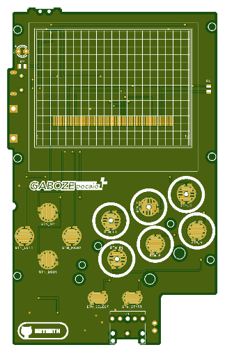
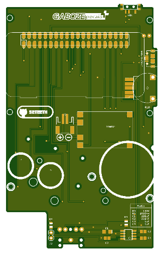

## Введение

### Gaboze Pocaio - Pocket All In One Remix
Это переработанная версия оригинального проекта [Gaboze Pocaio - Pocket All In One](https://github.com/32teeth/GabozePocaio-Round1)

### Features:

* 2.6" TFT LCD
* Gameboy button layout interface
* Raspberry Pi Zero
* Battery Charger (TP4056 Module)
* Headphone Jack (LM4857)
* Speaker capability (LM4857)

### Platforms:

The boards have been tested with the following platforms:

- [x] [Emulation Station](http://www.emulationstation.org/)

| Build Your Own |
|:--:|
| |
| *Gaboze Pocaio Plus REMIX* |

- [x] [RetroPie](https://retropie.org.uk/)

## DIY
> Building this yourself? Read the [Wiki](https://github.com/32teeth/GabozePocaio-Round1/wiki/)
* [Preperation](https://github.com/32teeth/GabozePocaio-Round1/wiki/DIY---Preperation)
* [Sound](https://github.com/32teeth/GabozePocaio-Round1/wiki/DIY---Sound-Components)
* [Display](https://github.com/32teeth/GabozePocaio-Round1/wiki/DIY---TFT-Display)

## Details
> The source files have been officially released. Check out the [Files](https://github.com/32teeth/GabozePocaio-Round1/tree/master/eagle/Release) and build away

| Top                                                          | Bottom                                                                          |Money Shot                   |
| ------------------------------------------------------------ | ------------------------------------------------------------ |-----------                   |
|  |  |  |

## Plus Edition
> This is a 2.6" TFT version of the Gaboze Pocaio. The Gerber Files are in the [Plus](https://github.com/32teeth/GabozePocaio-Round1/tree/master/gerber/Plus) folder

| Top                                                          | Bottom   |Prototype Shot                   |
| ------------------------------------------------------------ | ------------------------------------------------------------ |-----------                   |
|  |  | |

| Overview                                  | Front PCB                                 | Back PCB                                  | Screen                                   | Layout                                    | OSH                                       |
| ----------------------------------------- | ----------------------------------------- | ----------------------------------------- | ----------------------------------------- | ----------------------------------------- | ----------------------------------------- |
|  |  |  |  |  |  |

## Extensions
> So you want to add your own components?

Check out the Gaboze Pocaio Extension Boards
These are available in the [gerber](https://github.com/32teeth/GabozePocaio-Round1/tree/master/gerber) folder

### Auxiliary Board

**Features **

* Power Indicator LED
* Volume Thumbwheel Potentiometer
* Power Input Pins
* Power + Potentiometer Output Pins

|Top|Bottom|Physical|
|-----|-----|-----|
||||

[gerber](https://github.com/32teeth/GabozePocaio-Round1/tree/master/gerber/GabozePocaio-Extension-Aux)

### Button + Audio Board

**Features **

* LM4875 Audio Amp
* Headphone Jack
* 4/8 Ohm Speaker Output
* Power + PWM + Potentiometer Input Pins
* Button Pad Output Pins

|Top|Bottom|Physical|
|-----|-----|-----|
||||

[gerber](https://github.com/32teeth/GabozePocaio-Round1/tree/master/gerber/GabozePocaio-Extension-Button-Audio)

## Upgrade to 2.6"
> So you want to upgrade your screen size?

Here's the perfect daughter board solution
These are available in the [gerber](https://github.com/32teeth/GabozePocaio-Round1/tree/master/gerber) folder

**Features **

* Upgrade your display to a 2.6"

**Caviat**

* You WILL NEED to update your Raspberry Pi image with the ILI9342 driver
* If you choose to get a PCB made, make sure it's 0.6mm thickness (optimal is 0.4mm but it will be expensive)

|Top|Bottom|Physical|
|-----|-----|-----|
|||NO IMAGE|

[source](https://github.com/32teeth/GabozePocaio-Round1/tree/master/eagle/Upgrade)
[gerber](https://github.com/32teeth/GabozePocaio-Round1/tree/master/gerber/Upgrade)

## Cartridge Shell
> So you want to print your own cartridge battery holder

|  |
|:--:|
| *[download stl](https://raw.githubusercontent.com/32teeth/GabozePocaio-Round1/master/3d/cartridge.stl)* |

# Buy me a Coffee
> This is a labor of love, and much time has been put in...  ...i could use a [coffee](https://www.paypal.me/32teeth/1usd) *(donuts are okay too)*

**Thank you for your support**

-----

## Seriously
> READ THE [WIKI](https://github.com/32teeth/GabozePocaio-Round1/wiki/)

-----

### Get In Touch

|      |
| ---- |
| Find me on the internet and lets chat |

